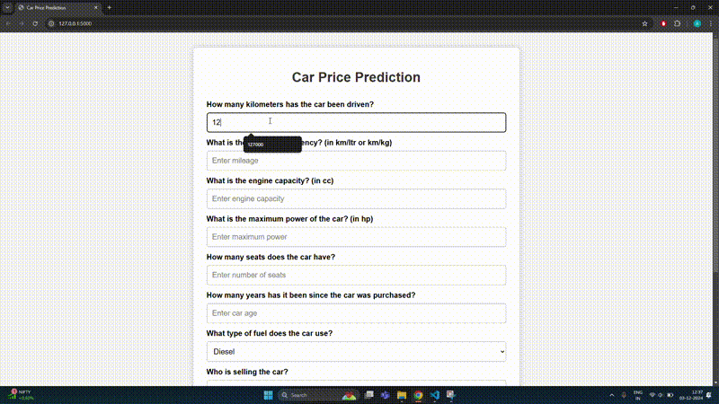

# Car Resale Price Prediction     

## Project Overview
The Chief Technology Officer (CTO) at Cardekho24 has requested the data science team to develop and integrate a car price prediction model into the website. This tool will allow sellers to estimate the price of their cars before listing them, based on various features such as make, model, age, mileage, and condition. The data science team will be responsible for developing the model, preprocessing the data, and ensuring its accuracy. The model will then be integrated into the website through a user-friendly interface, enabling sellers to receive price estimates in real-time. This feature aims to improve the seller experience and drive better engagement on the platform.

## Repository Structure
```
├── static/
│   └── demo.css             # GIF of Model working                                   
│   └── styles.css           # CSS file for styling the web interface
├── templates/               
│   └── index.html           # Main HTML file for the web interface
├── app/                     
│   └── app.py               # Main Flask app to serve the model and web interface
├── car_price_prediction/    # Python scripts for data analysis and model building
├── car_price_model.pkl      # Serialized machine learning model for deployment
├── scaler.pkl               # Serialized MinMaxScaler used for scaling features
├── cardekho.csv             # Dataset used for training and testing
├── requirements.txt         # Python dependencies required to run the project
└── README.md                # Project overview and instructions
```
## Model Working Demo


## Model Performance
I evaluated the performance of multiple models, including Linear Regression, Support Vector Regressor (SVR), Decision Tree Regressor, Random Forest Regressor, Ridge, Lasso, and XGBRegressor. Among these, the Random Forest Regressor achieved the best performance, yielding the highest R² score and the lowest RMSE.

To optimize the model, I used GridSearchCV to find the best hyperparameters. The model was then trained with these optimal parameters, resulting in the following metrics:

- Training R²: 0.8331
- Training RMSE: 0.2372
- Test R²: 0.7038
- Test RMSE: 0.3088

## Data Assumptions, Model Limitations, and Future Improvements
The dataset includes cars with selling prices ranging from affordable to luxury, with a total range of 22,50,000. This indicates a diverse price distribution, which significantly impacts the model's performance. This variability is strongly influenced by the brand of the car, this feature that was not included in the model training.

Due to the absence of brand-related information, the model’s ability to capture the inherent value associated with different car brands was curtailed. For example, two cars with similar specifications might have vastly different selling prices due to differences in brand reputation, which affects their perceived value in the market.

#### Potential Solution
The dataset provided only includes the resale price of each car, without accounting for critical factors like the current market price of the model or whether the model is still in production. These factors significantly influence the resale value, as the market price serves as a benchmark for determining a car's worth. Incorporating a feature that reflects the current market price of the car, or a similar benchmark value for each brand and model, would provide the model with crucial context. This would improve the model’s ability to predict selling prices, potentially resulting in higher R² and lower RMSE values, as the model would better capture the variability in prices across the entire range.
